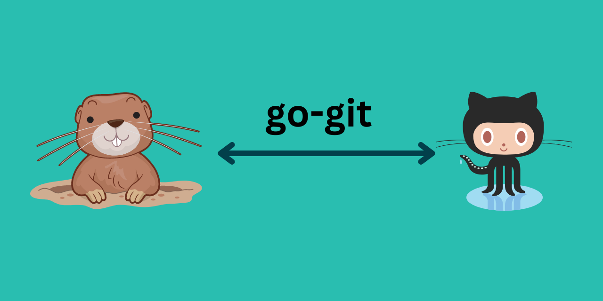

# go-git
A customized github api with Go.
 
 

## Table of Contents

- [go-git](#go-git)
  - [Table of Contents](#table-of-contents)
  - [Introduction](#introduction)
  - [Installation](#installation)
  - [Usage](#usage)
  - [Contributing](#contributing)

## Introduction

Nothing interesting. I'm currently learning Go and wanna do something that works

## Installation

* First install Go on your environment. ( [link](https://go.dev/doc/install) )
* Clone this repo
* Genereate a classic personal access token here [https://github.com/settings/tokens](https://github.com/settings/tokens)
* If you are with mac/linux, just run setup.sh file. 
* For windows user,
               
              `cd getpass`
               
              `go mod tidy`
               
              `cd githubapi`
               
              `go mod tidy`
* Finally, you go to githubapi directory and type `go run .`

## Usage

When you have done all the steps in installation, you will see this.

When you type personal access token, this will not be shown in command prompt(because I used a module for security).

## Contributing

Contributions welcome! Just PR. <3

